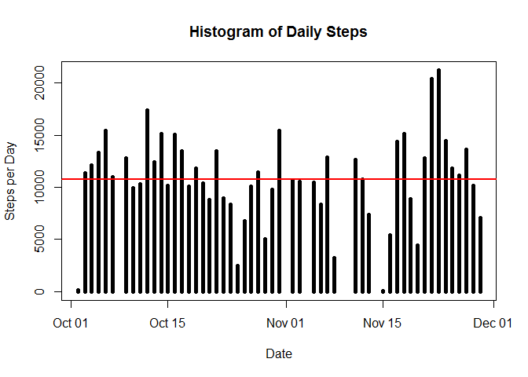
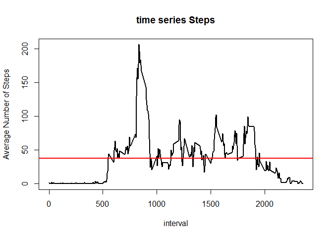

# Reproducible Research: Assessment 1
Dapeng  
## First, identify the library need for the project

```r
library("plyr")
library("knitr")
library("reshape2")
library("ggplot2")
```

## Loading and preprocessing the data
The data is a .csv file and saved in "activity.csv".

```r
File_Path <- "./activity.csv"
data = read.table(file = File_Path,header=T, quote="\"", sep=",")
data$date <- as.Date(data$date)
head(data)
```

```
##   steps       date interval
## 1    NA 2012-10-01        0
## 2    NA 2012-10-01        5
## 3    NA 2012-10-01       10
## 4    NA 2012-10-01       15
## 5    NA 2012-10-01       20
## 6    NA 2012-10-01       25
```

## Question 1: What is mean total number of steps taken per day?
We will ignor the NA values in the steps

1. We will calculate the number of steps taken per day
2. Make a Histogram plot on the steps per day for the past 2 months
3. Calculate the mean value


```r
data_NO_na <- melt(data = data,id.vars="date", measure.vars="steps", na.rm= TRUE)
steps_date <- dcast(data_NO_na, date ~ variable, sum)
plot(steps_date$date, steps_date$steps, type="h", main="Histogram of Daily Steps",xlab="Date", ylab="Steps per Day", col="black", lwd=5)
abline(h=mean(steps_date$steps), col="red", lwd=2)
```

<!-- -->

The Mean steps per day is:

```
## [1] 10766.19
```
The Median steps per day is:

```
## [1] 10765
```

## Question 2: What is the average daily activity pattern?

1. Make a time series plot of the 5-minute interval (x-axis) and the average number of steps taken, averaged across all days (y-axis)
2. Which 5-minute interval, on average across all the days in the dataset, contains the maximum number of steps?


```r
data_NO_na <- melt(data = data,id.vars="interval", measure.vars="steps", na.rm= TRUE)
interval_date <- dcast(data_NO_na, interval ~ variable, mean)
head(interval_date)
```

```
##   interval     steps
## 1        0 1.7169811
## 2        5 0.3396226
## 3       10 0.1320755
## 4       15 0.1509434
## 5       20 0.0754717
## 6       25 2.0943396
```

```r
plot(interval_date$interval, interval_date$steps, type="l", main="time series Steps",xlab="interval", ylab="Average Number of Steps", col="black", lwd=2)
abline(h=mean(interval_date$steps), col="red", lwd=2)
```

<!-- -->

Report the interval for max steps

```r
h=interval_date$interval[which(interval_date$steps == max(interval_date$steps))]
max<-max(interval_date$steps)
paste("Interval with max steps is", h)
```

```
## [1] "Interval with max steps is 835"
```

```r
paste("The max steps for interval is", max)
```

```
## [1] "The max steps for interval is 206.169811320755"
```

https://rpubs.com/Liang/Reproducible_Research_porject_1

## Imputing missing values


## Are there differences in activity patterns between weekdays and weekends?
